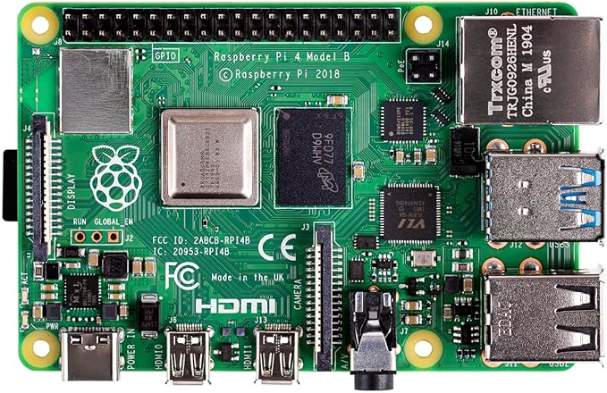
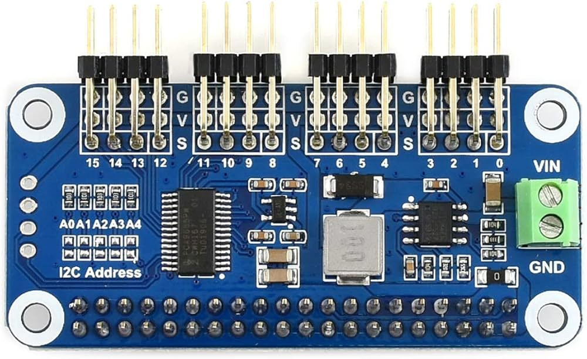

# servo_controller


<p float="left">
  
  
  
</p>


ROS2 Humble package to control a Waveshare 16-Channel Servo Driver HAT (PCA9685)
from a Raspberry Pi using I2C. See [wiki](https://www.waveshare.com/wiki/Servo_Driver_HAT).

This package is based on the official Waveshare PCA9685 `smbus` driver.

Tested on:
- Raspberry Pi 4
- ROS2 Humble
- Waveshare Servo Driver HAT (B)
- [diymore DM996 servos](https://www.amazon.fr/stores/page/CC9B6A37-EC86-43B5-A5B9-63367374441A?ingress=2&lp_context_asin=B09KZRPJ41&visitId=5ccad30e-d920-4362-91fb-e485a9736bfa&ref_=ast_bln)

---

## Features

- Control up to **16 servos independently**
- Angle-based control (**degrees**, not raw PWM)
- Uses standard ROS2 message: `std_msgs/Int16MultiArray`
- Safe angle clamping (0–180°)

---

## Hardware Requirements

- Raspberry Pi with I2C enabled
- Waveshare Servo Driver HAT (PCA9685, I2C address `0x40`)
- 5v connected on GPIO pins (VIN not used so far).

---

## ROS2 Interface

### Subscribed Topic

**`/servo_command`**  
Type: `std_msgs/msg/Int16MultiArray`

- `data[i]` → target angle (in degrees) for servo channel `i`
- Up to 16 channels supported
- Angles are clamped internally to `[0, 180]`

Example:
```text
data: [45, 0]
```
→ Servo 0 goes to 45°, Servo 1 goes to 0°

---

## Package Structure

```
servo_controller/
├── CMakeLists.txt
├── package.xml
├── setup.py
├── setup.cfg
├── launch/
│   └── servo_launch.py
└── servo_controller/
    ├── __init__.py
    └── servo_node.py
```

---

## Build Instructions

Make sure I2C and smbus are installed:

```bash
sudo apt install python3-smbus i2c-tools
sudo raspi-config   # Enable I2C
```

Build the package:

```bash
cd ~/ros2_ws/src
git clone https://github.com/gerald-rocher/waveshare-pca9685-ros2.git
mv waveshare-pca9685-ros2 servo_controller
cd ..
colcon build --packages-select servo_controller
source install/setup.bash
```

---

## Running the Node

```bash
ros2 run servo_controller servo_node
```

Expected output:
```
[INFO] [servo_controller_node]: Waveshare Servo Driver HAT (PCA9685) ROS2 controller started
```

---

## Example Usage

### Move one servo (channel 0) to 45 degrees

```bash
ros2 topic pub /servo_command std_msgs/Int16MultiArray "data: [45]"
```

### Control two servos simultaneously

```bash
ros2 topic pub /servo_command std_msgs/Int16MultiArray "data: [30, 90]"
```
---

## Notes on Servo Speed

Servo speed depends on:
- Servo model (e.g. DM996)
- Supply voltage
- Mechanical load

Example DM996 specification:
```
0.17 s / 60° @ 4.8 V (no load)
```

---

## License

MIT License

